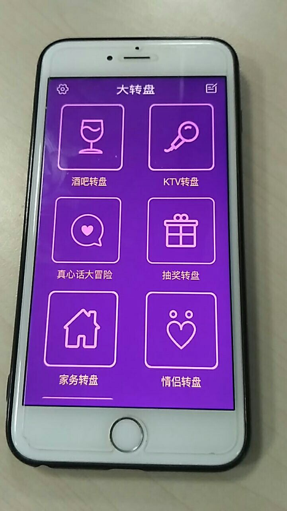
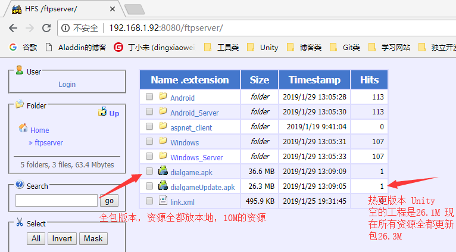

# GFFrameWork
Unity+ILRuntime框架

## Demo效果图

## 开发环境
* Unity2018.3.2

## 框架功能
* UI管理
* UI动画系统
* UGUI扩展组件
* Log模块
* 本地存储(Sqlite+二进制文本)
* C#更新
* 资源打包及更新

## 后续待添加的功能
* 缓存池
* 动作、技能编辑器
* 自动化打包

## Unity 插件
* UGUI
* Dotween

## Demo下载
[下载](http://staticresource-1251021262.cossh.myqcloud.com/test/dialgameUpdate%E5%A4%96%E7%BD%91%E7%89%88%E6%9C%AC.apk )

## 教程说明
教程文档请看wiki，文档陆陆续续完善中！
[更多教程](http://dingxiaowei.cn)